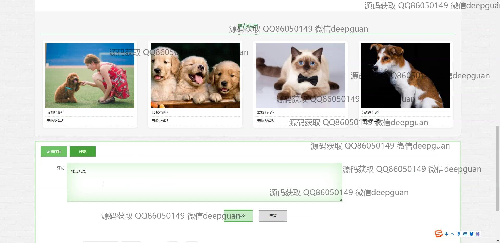
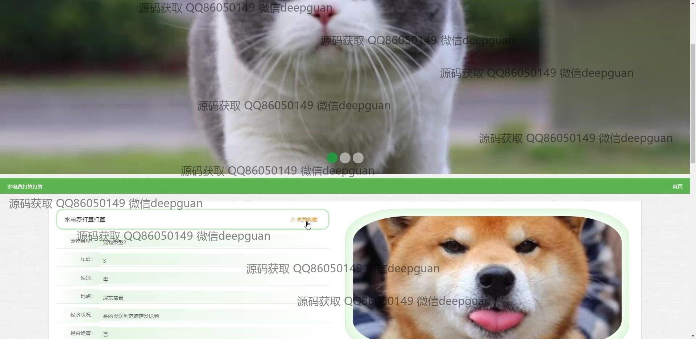
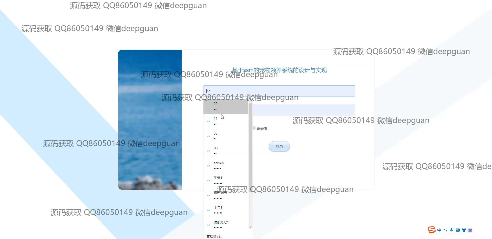

<h1 align="center">基于的宠物领养系统的设计与实现</h1>

## 简介
宠物领养系统：角色分为管理员、用户；主要功能包括用户注册与登录、宠物信息管理、领养申请与审核、寄养与弃养信息管理、评论与交流论坛。    --计算机毕业设计源码；毕设源码；java毕业设计源码

## 联系方式

<h3 align="center">获取完整代码与数据库文件 + 微信：deepguan QQ: 86050149 QQ群: 783742310</h3>

<h3 align="center">可帮忙远程部署 包运行成功！提供远程部署、修改代码、设计文档指导、代码讲解等服务！</h3>

## 功能介绍（完整见运行截图）
管理员：主要负责系统后台管理，包括宠物信息管理、用户管理和领养申请审核。还能查看弃养申请，并通过审核窗口选择状态和填写审核回复。此外，管理员还可以管理弃养申请和轮播图等功能模块，以提高系统管理工作的效率与审核流程的规范性。

用户：通过注册和登录进入系统，可以查看和筛选宠物信息、提交领养申请、寄养申请以及进行相关操作和评论。用户还可以通过交流论坛发布帖子，分享领养经验或咨询其他用户。同时，个人中心功能帮助用户查看和管理自己的信息和收藏。

访客：无需登录即可浏览宠物基本信息、图片和评论功能模块，但不能进行领养申请或发表评论。访客可以通过系统的导航栏快速访问不同模块，了解宠物知识和寄养信息，便于对系统提供的服务有全面认知。

系统界面：设计简洁，以用户友好和功能性为核心，提供首页导航、宠物推荐、交流论坛、公告信息等模块。用户可以通过主菜单导航进行模块切换，也可在首页通过图文结合的方式快速查看感兴趣的宠物及了解系统功能。

## 运行截图

本代码来源于网络,仅供学习参考使用!

